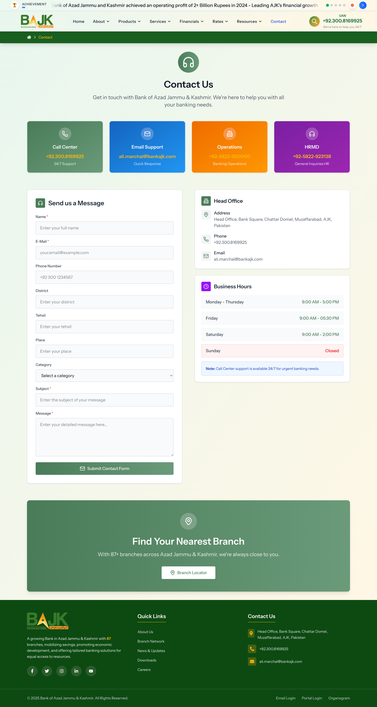

# Project Title: Bank of Azad Jammu & Kashmir - Next Generation Website

## Overview

This project is the development of a new, modern website for the Bank of Azad Jammu & Kashmir. The primary goal is to create a user-friendly, secure, and technologically advanced online presence for the bank.

## Key Features & Technologies

- **Framework:** Laravel 12 (PHP `^8.2`)
- **Frontend:** React (`^2.0.11` via `@inertiajs/react`), TypeScript
- **UI Library:** Inertia.js (`^2.0` for Laravel, `^2.0.11` for React)
- **Styling:** Tailwind CSS (default with Laravel 11+), Mobile Responsive Design
- **Authentication:** Native Laravel authentication
- **Permissions:** `spatie/laravel-permission` (`^6.18`)
- **Query Building:** `spatie/laravel-query-builder` (`^6.3`)
- **Routing in JS:** Tighten/Ziggy (`^2.4`)
- **Database:** Postgresql
- **Deployment:** (Specify your deployment environment, e.g., Docker, AWS, etc.)

## Project Goals

- Enhance customer experience with a modern and intuitive interface.
- Provide comprehensive information about banking products and services.
- Ensure high levels of security and data protection.
- Improve operational efficiency through streamlined online processes.
- Leverage the latest web technologies for a robust and scalable platform.

## Development Environment

- **PHP:** `^8.2`
- **Node.js:** `^22.15.21` (or latest LTS)
- **Package Managers:** Composer, Bun
- **Build Tool:** Vite
- **Linting:** ESLint
- **Code Formatting:** Prettier
- **Dev Tools:** Laravel Tinker, Larastan, PHP CS Fixer, Pail, Pint, Sail

## Project Features

This comprehensive banking website includes the following key modules:

### Core Banking Features

- **Product Management**: Complete product catalog with schemes and attributes
- **Service Management**: Banking services with detailed descriptions and attributes
- **Branch Network**: Branch locations with services offered
- **Financial Reports**: Annual reports, financial highlights, and downloadable documents
- **Board & Management**: Information about directors and management team
- **News & Announcements**: Latest updates and bank announcements
- **Career Portal**: Job opportunities and career information
- **Customer Support**: Contact forms and customer service information

### Technical Features

- **Multi-role Authentication**: Admin, Manager, and User roles with permissions
- **Search Functionality**: Advanced search across all content
- **File Management**: Upload and manage documents, images, and reports
- **Regional Management**: Districts, divisions, and regional organization
- **Content Management**: Dynamic pages and menu management
- **Mobile Responsive**: Optimized for all device sizes
- **SEO Optimized**: Search engine friendly URLs and meta tags

## Prerequisites

Before you begin, ensure you have the following installed on your system:

- **PHP**: `^8.2` with extensions (mbstring, xml, curl, bcmath, intl, gd, zip)
- **Node.js**: `^22.15.21` (LTS recommended)
- **Composer**: Latest version
- **Bun**: Package manager (alternative to npm/yarn)
- **PostgreSQL**: Database server
- **Git**: Version control

## Getting Started

Follow these steps to set up the project locally:

### 1. Clone the Repository

```bash
git clone <repository-url>
cd Genexis
```

### 2. Install PHP Dependencies

```bash
composer install
```

### 3. Install JavaScript Dependencies

```bash
bun install
# or alternatively
npm install
```

### 4. Environment Configuration

```bash
# Copy the environment file
cp .env.example .env

# Generate application key
php artisan key:generate
```

### 5. Database Setup

Configure your database in the `.env` file:

```env
DB_CONNECTION=pgsql
DB_HOST=127.0.0.1
DB_PORT=5432
DB_DATABASE=genexis_bank
DB_USERNAME=your_username
DB_PASSWORD=your_password
```

Run migrations and seeders:

```bash
# Run database migrations
php artisan migrate

# Seed the database with sample data
php artisan db:seed

# Create storage link for file uploads
php artisan storage:link
```

### 6. Build Assets

For development:

```bash
# Start the development server with hot reload
bun run dev
# or
npm run dev
```

For production:

```bash
# Build optimized assets
bun run build
# or
npm run build
```

### 7. Start the Application

```bash
# Start Laravel development server
php artisan serve
```

Your application will be available at `http://localhost:8000`

### 8. Default Credentials

After seeding, you can login with:

- **Admin**: admin@example.com / password
- **Manager**: manager@example.com / password
- **User**: user@example.com / password

## Development Workflow

### Code Quality Tools

This project includes several tools to maintain code quality:

```bash
# PHP Code Style (Laravel Pint)
./vendor/bin/pint

# PHP Static Analysis (Larastan)
./vendor/bin/phpstan analyse

# PHP Code Sniffer
./vendor/bin/phpcs

# JavaScript/TypeScript Linting
bun run lint
# or fix automatically
bun run lint:fix

# Format code with Prettier
bun run format

# Type checking
bun run types

# Run all checks
bun run ci
```

### Testing

```bash
# Run PHP tests with Pest
php artisan test

# Run specific test file
php artisan test tests/Feature/UserTest.php

# Run tests with coverage
php artisan test --coverage
```

### Database Management

```bash
# Create a new migration
php artisan make:migration create_table_name

# Create a new model with migration
php artisan make:model ModelName -m

# Create a factory
php artisan make:factory ModelNameFactory

# Create a seeder
php artisan make:seeder TableNameSeeder

# Fresh migration with seeding
php artisan migrate:fresh --seed
```

### File Generation Commands

```bash
# Create a controller
php artisan make:controller ControllerName

# Create a request class
php artisan make:request RequestName

# Create a resource
php artisan make:resource ResourceName

# Create a policy
php artisan make:policy PolicyName

# Create a service class
php artisan make:service ServiceName

# Create a view
php artisan make:view view-name
```

## Project Structure

```
app/
├── Http/
│   ├── Controllers/     # Application controllers
│   ├── Middleware/      # Custom middleware
│   └── Requests/        # Form request validation
├── Models/              # Eloquent models
├── Policies/            # Authorization policies
├── Services/            # Business logic services
└── Traits/              # Reusable traits

resources/
├── js/                  # React components and TypeScript
├── css/                 # Stylesheets
└── views/               # Blade templates

routes/
├── web.php             # Web routes
├── auth.php            # Authentication routes
├── settings.php        # Settings routes
└── console.php         # Console commands
```

## Contribution Guidelines

We welcome contributions to this project! Please follow these guidelines:

### Getting Started

1. **Fork the repository** and create your feature branch from `main`
2. **Follow the coding standards** outlined below
3. **Write tests** for any new functionality
4. **Update documentation** as needed

### Coding Standards

#### PHP/Laravel Standards

- Follow **PSR-12** coding standards
- Use **Laravel's naming conventions**:
    - Models: `PascalCase` (e.g., `BankService`)
    - Controllers: `PascalCase` + `Controller` (e.g., `BankServiceController`)
    - Methods: `camelCase` (e.g., `getUserData`)
    - Variables: `camelCase` (e.g., `$userData`)
- Use **type hints** and **return types** where possible
- Write **meaningful commit messages**
- Use **Laravel's built-in features** (Eloquent, Collections, etc.)

#### Frontend Standards

- Follow **React** and **TypeScript** best practices
- Use **functional components** with hooks
- Implement **proper TypeScript typing**
- Follow **Tailwind CSS** utility-first approach
- Use **Radix UI** components when available
- Maintain **responsive design** principles

#### Database Standards

- Use **descriptive migration names**
- Follow **alphabetical order** for pivot tables (e.g., `project_role` not `role_project`)
- Include **proper indexes** and **foreign key constraints**
- Use **meaningful column names**

### Code Review Process

1. **Create a Pull Request** with a clear title and description
2. **Link any related issues** in the PR description
3. **Ensure all tests pass** and code quality checks are green
4. **Request review** from at least one maintainer
5. **Address feedback** promptly and professionally

### Bug Reports

When reporting bugs, please include:

- **Steps to reproduce** the issue
- **Expected behavior** vs **actual behavior**
- **Environment details** (OS, PHP version, browser, etc.)
- **Screenshots** or error messages if applicable

### Feature Requests

For new features:

- **Describe the problem** you're trying to solve
- **Propose a solution** with implementation details
- **Consider backward compatibility**
- **Discuss performance implications**

### Development Setup for Contributors

1. Follow the standard **Getting Started** guide above
2. Set up **pre-commit hooks**:
    ```bash
    # Install pre-commit hooks
    composer install --dev
    ```
3. **Run tests** before submitting:
    ```bash
    php artisan test
    bun run ci
    ```

## Deployment

### Production Environment

1. **Optimize for production**:

    ```bash
    composer install --optimize-autoloader --no-dev
    php artisan config:cache
    php artisan route:cache
    php artisan view:cache
    bun run build
    ```

2. **Set proper permissions**:

    ```bash
    chmod -R 755 storage bootstrap/cache
    ```

3. **Configure web server** (Nginx/Apache) to point to the `public` directory

### Environment Variables

Key production environment variables:

```env
APP_ENV=production
APP_DEBUG=false
APP_URL=https://your-domain.com

# Database
DB_CONNECTION=pgsql
DB_HOST=your-db-host
DB_DATABASE=production_db
DB_USERNAME=production_user
DB_PASSWORD=secure_password

# Mail Configuration
MAIL_MAILER=smtp
MAIL_HOST=your-smtp-host
MAIL_PORT=587
MAIL_USERNAME=your-email
MAIL_PASSWORD=your-password

# File Storage
FILESYSTEM_DISK=public
```

## Security

- **Keep dependencies updated** regularly
- **Use environment variables** for sensitive configuration
- **Implement proper validation** on all user inputs
- **Follow Laravel security best practices**
- **Regular security audits** with `composer audit`

## Support

For support and questions:

- **Documentation**: Check this README and Laravel documentation
- **Issues**: Create a GitHub issue for bugs or feature requests
- **Email**: [your-support-email@domain.com]

## License

This project is proprietary software developed for the Bank of Azad Jammu & Kashmir. All rights reserved.

## Changelog

### Version 1.0.0 (Current)

- Initial release with core banking features
- React + TypeScript frontend
- Laravel 12 backend
- PostgreSQL database
- Spatie packages integration

## Application Snapshots

This document provides an overview of key application pages based on the provided snapshots.

### Contact Us Page



**Key Features:**
- Multiple contact methods: Call Center, Email Support, Operations, HR/MD.
- "Send us a Message" form with fields: Name, E-Mail, Phone, District, Tehsil, Place, Category, Subject, Message.
- Head Office address and contact details.
- Business Hours information.
- Link to Branch Locator.

### Banking Services / Homepage Snippet


**Key Features:**
- "Car Finance" banner.
- Overview of Banking Services with statistics (Branches, Customers, Rs 50B+ Deposits, Employees).
- Sections for Consumer Finance, Commercial / SME Finances, Agriculture Finances, Micro Finances, each with key benefits and available products.
- Additional Banking Solutions: Deposit Accounts, Term Deposits, Online Banking, Locker Facility.
- Call to action to "Find Nearest Branch" and "Call".
- "Latest News & Updates" section.

---

**Note:**
To view these images, please ensure you have saved your snapshot images as:
- `contact_us_page.png`
- `banking_services_page.png`
and placed them into the `/Users/alirazamarchal/Herd/Genexis/public/screenshots/` directory.
The Markdown file references them using relative paths like `public/screenshots/contact_us_page.png`.

---

_This README was last updated on June 13, 2025._
